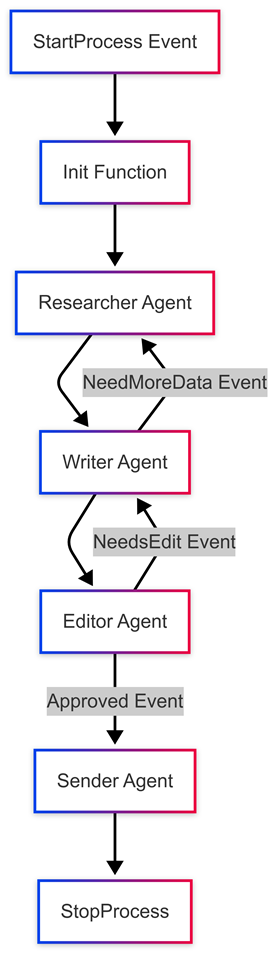

# Semantic Kernel + Azure AI Foundry Agent Service demo

In this demo, we will show how to use the Semantic Kernel process framework to orchestrate multiple Azure AI Foundry Agent Service agents.

## Prerequisites
You'll need an Azure AI Foundry project with the following agents. You can find the code to create these agents in the `agents` folder.

- Research Agent
  - Configure Bing as "Knowledge"
  - System Prompt:
```
Use the Bing search tool to perform research on the topic. 
You are only the researcher, not the report writer, 
so simply provide all the information you find.
```

- Writer Agent
  - System Prompt:
```
Your job is to write the report. 
Call the "need more research" tool if you need more data.
Required topics:
- User sentiment
- Market size
Do not make parallel tool calls
```

- Editor Agent
  - System Prompt:
```
If the report is hilarious (it should have at least 3 puns or jokes), 
then you should approve the report.
Otherwise, approve it and list out the puns and jokes that were in the report.
```

- Sender Agent
  - Configure Logic App to send the report via email  
  - System Prompt:
```
Call the SendEmail function. The body must be the report. 
Address it to mark.harrison@xxxx.com and use HTML instead of markdown.
```

## Process Flow




## Example Usage


